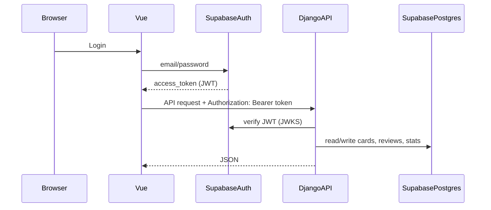

# Personal Anki v2 (Redesign + Deploy)

## Current state (what you already built)

- **Stack**: Django REST API + Vue SPA, wired via Docker Compose. Backend runs `:8000`, frontend dev server runs `:8080`.
- **SRS + stats already exist**:
  - SRS logic lives in `Sentence.process_review()` with SM2-ish EF + learning steps.
  - API endpoints already cover next-card, submit-review, stats, sentence list/detail.
  - Bidirectional exists at the model layer via `translation_direction` (`S2E`/`E2S`).
- **Why it feels bloated**: it’s a “PRD-complete” architecture (Docker + API + SPA + tests) for what is essentially a personal learning tool; plus the data model is tied to the initial CSV schema (“sentence-centric”), which fights your new “general cards” requirement.

Key existing files:

- Backend: [`/home/ben/all_projects/spanish/anki_web_app/flashcards/models.py`](/home/ben/all_projects/spanish/anki_web_app/flashcards/models.py), [`/home/ben/all_projects/spanish/anki_web_app/flashcards/views.py`](/home/ben/all_projects/spanish/anki_web_app/flashcards/views.py), [`/home/ben/all_projects/spanish/anki_web_app/flashcards/tests.py`](/home/ben/all_projects/spanish/anki_web_app/flashcards/tests.py)
- Docker dev: [`/home/ben/all_projects/spanish/docker-compose.yml`](/home/ben/all_projects/spanish/docker-compose.yml), [`/home/ben/all_projects/spanish/run.sh`](/home/ben/all_projects/spanish/run.sh)

## Immediate unblock: run locally again (your docker-compose error)

You’re hitting:

- `TypeError: kwargs_from_env() got an unexpected keyword argument 'ssl_version'`

This is almost always **Python-installed docker-compose v1** (`~/.local/bin/docker-compose`) mismatching the installed `docker` Python SDK.

Plan to fix (pick one; we’ll implement the simplest):

- **Preferred**: use Docker Compose v2 plugin (`docker compose ...`) and stop using the Python `docker-compose` binary.
- **Fallback**: pin compatible versions of `docker-compose` v1 + `docker` python library (more fragile long-term).

Once fixed, local run is:

- `docker compose up -d --build` (or `docker-compose up -d --build` if v1 is working)
- Frontend at `http://localhost:8080`, backend at `http://localhost:8000`

## v2 product requirements (what we’re designing toward)

### Users

- **Two users** (you + girlfriend) with **email+password**.
- You also use **different emails per language**, so languages naturally separate by user account.

### Cards

- **General two-sided card** model (no explicit card types):
  - Front (prompt) = rich text
  - Back (answer) = rich text
  - Optional fields: `language`, `tags`, `notes`, `source`, etc.
- **Bidirectional by default**:
  - When a card is created, we auto-create the reverse card and link them.
  - Each direction has its **own SRS schedule and stats**.

### Reviews

- Review captures:
  - score (0–1)
  - optional comment
  - optional **typed input** (your girlfriend’s entry box) stored, not graded yet

### Import/edit

- From the frontend: upload **CSV/TSV** (first), mapping columns to Front/Back.
- All cards editable.

### KPIs

Track *everything* now; later choose a “main” KPI.

- Examples we’ll compute per user:
  - due count, reviews/day, new cards/day
  - retention (pass rate / avg score)
  - matured count
  - coverage (seen at least once)
  - time studied (with AFK trimming)

### Study time + AFK

- Add a lightweight **client heartbeat + activity events**.
- Server computes “active minutes” by ignoring gaps > N minutes (configurable) even on mobile.

## Architecture choice (fits your decision)

- **Supabase**: Auth + Postgres (and optionally Storage for uploads/backups)
- **Hetzner**: Dockerized deployment for Django API + Vue UI + Nginx reverse proxy + TLS

High-level flow:

## Implementation plan (phased, delete complexity first)

### Phase 0 — Stabilize dev workflow

- Switch scripts to `docker compose` (v2) and add a short “Dev Quickstart” section.
- Ensure backend + frontend run locally reliably.

### Phase 1 — Data model refactor: Sentence -> Card

- Introduce a new `Card` model (general front/back) and `Review` referencing `Card`.
- Add `linked_card` (or `pair_id`) to represent reverse links.
- Keep the existing SRS fields, but make them belong to `Card`.

### Phase 2 — Supabase Auth integration

- Frontend handles login via Supabase.
- Backend verifies Supabase JWT; map Supabase `sub` to a local `User` record (or store the `sub` directly).
- Scope all queries by authenticated user.

### Phase 3 — Import + CRUD UI

- Add “Import cards” page:
  - upload CSV/TSV
  - preview + column mapping
  - import creates forward+reverse
- Add “Card editor” page.

### Phase 4 — Review UX (including typing input)

- Review screen:
  - show front
  - reveal back
  - optional typed input box saved with review
  - score + comment
  - submit & next

### Phase 5 — KPIs + time tracking

- Add study-session endpoints:
  - start session, heartbeat/activity ping, end session
- Compute active minutes with AFK threshold.
- Expand dashboard stats (keep existing ones as base).

### Phase 6 — Hetzner deployment

- Add production `docker-compose.prod.yml` (or profiles) + Nginx reverse proxy.
- Add TLS via Let’s Encrypt (Nginx + certbot container or Caddy).
- Set env vars for Supabase + Django settings.

### Phase 7 — Cleanup + rename

- Remove duplicate/legacy folders (there’s an extra top-level `spanish_anki_frontend/`).
- Rename repo to `personal_anki_cards` (GitHub + local).

## “Why not just Anki?” (guidance for your redesign doc)

- **Anki wins** at: mature SRS, offline-first mobile UX, plugin ecosystem.
- **Your app wins** if you want:
  - first-class sentence workflow + notes + custom KPIs
  - couple/shared decks + your own editing/import flows
  - “study time + AFK minutes” and bespoke dashboards
  - product iteration tailored to your exact learning style

Recommendation: treat v2 as **Anki-like review engine + your custom UX/KPIs**, not a full Anki replacement.

## Language-learning guidance (teacher POV, tied to your features)

- **Default habit**: daily clear the “due” queue (inbox-zero) even if it’s small.
- **German**: include article/gender in the *answer*, and often in the prompt as a cloze (e.g., `___ Hund` → `der Hund`). Your “general two-sided card” supports this without explicit types.
- **Sentences vs words**:
  - Use **words** to nail gender/lemma quickly.
  - Use **sentences** to make recall robust + prevent “dictionary knowledge”.
- **Scoring**: keep 0/0.5/1 as shortcuts if 0–1 feels too fuzzy; you can still store it as float.

## What I need from you when we start executing

- Supabase project created (or we create one together): URL + anon key + service role key (kept server-side).
- Your desired “AFK threshold” default (e.g., 90s vs 5m).
- CSV format for import v1 (we’ll define it if you don’t care).